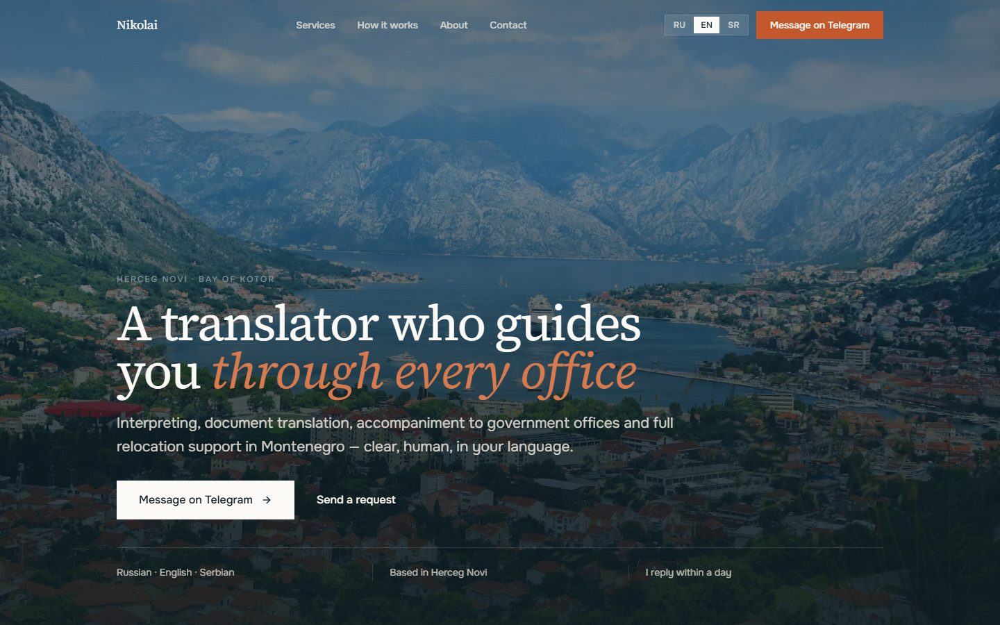
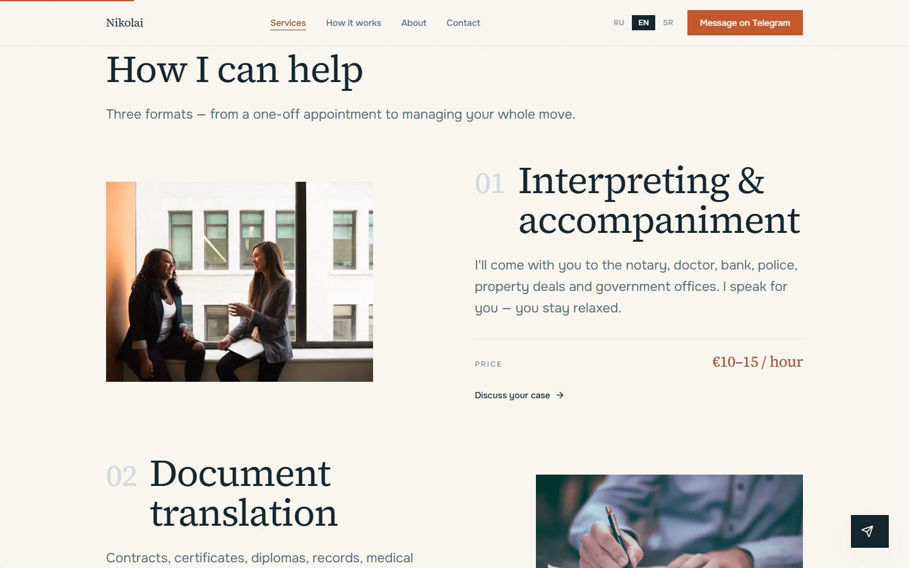
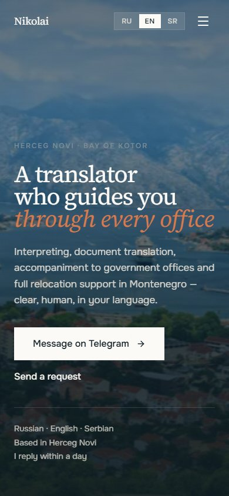

# Translator in Herceg Novi — personal website

A one-page, three-language website for a freelance translator in Herceg Novi, Montenegro. The goal is simple: earn trust fast and get a request in one or two clicks: Telegram, WhatsApp or a short form.




<table>
  <tr>
    <td width="72%"></td>
    <td width="28%"></td>
  </tr>
</table>

> 🇷🇺 Кратко по-русски — [ниже](#по-русски).

## Highlights

- **Three languages, one codebase.** RU at `/`, EN at `/en`, Serbian Latin at `/sr` via `next-intl`; every text lives in `messages/*.json`, `hreflang` alternates in the sitemap.
- **Editorial design.** Warm paper background, ink text, a single terracotta accent, hairline rules instead of cards, and a zig-zag services layout. Serif headings (Source Serif 4) with Onest body text. Both fonts have Cyrillic and Latin Extended, so all three languages render in the same typefaces.
- **Built to convert.** Telegram as the primary CTA, a floating Telegram button, a WhatsApp link and a Web3Forms contact form with no backend.
- **SEO basics done properly.** Per-locale metadata and OpenGraph, `ProfessionalService` and `FAQPage` JSON-LD, generated `sitemap.xml` / `robots.txt`, custom 404.
- **Motion that respects the user.** Scroll reveals with `motion` and smooth scrolling with `lenis`, both off under `prefers-reduced-motion`.
- **Checked visually.** Headless-browser pass at 1440 / 1024 / 375 px caught a duplicate `id` that broke a form label, a label wrap that misaligned the form grid, and a half-empty section on desktop. All three fixed.

## Stack

Next.js 16 (App Router, Turbopack) · React 19 · TypeScript · Tailwind CSS v4 · next-intl · motion · lenis · lucide-react · Web3Forms · Vercel Analytics

## Run locally

```bash
npm install
npm run dev      # http://localhost:3000
npm run build    # production build
```

Environment (`.env.local`):

| Variable | Purpose |
|---|---|
| `NEXT_PUBLIC_WEB3FORMS_KEY` | Web3Forms key: where form requests are delivered |
| `NEXT_PUBLIC_SITE_URL` | base URL for OpenGraph, sitemap and JSON-LD |

## Structure

```
src/
  app/[locale]/     layout + the page (all sections)
  app/globals.css   design tokens, palette, utilities
  app/sitemap.ts    sitemap.xml with hreflang
  app/robots.ts     robots.txt
  components/       Header, LocaleSwitcher, ContactForm, Reveal
  i18n/             next-intl routing, navigation, request
  config.ts         contacts and siteUrl
messages/           ru.json / en.json / sr.json: all copy
public/images/      photos of the Bay of Kotor
```

The project started from a written spec ([SPEC.md](SPEC.md)); deployment notes are in [DEPLOY.md](DEPLOY.md). Testimonials are anonymised placeholders until real client reviews are in.

---

## По-русски

Личный сайт-визитка переводчика в Херцег-Нови (Черногория): устный перевод и сопровождение, перевод документов, помощь релокантам. Задача сайта — быстро вызвать доверие и получить заявку в 1–2 клика.

Next.js 16 + TypeScript + Tailwind v4, три языка (RU / EN / SR-латиница) через next-intl, редакционный дизайн, форма на Web3Forms без бэкенда, JSON-LD и sitemap с hreflang. Начат с ТЗ ([SPEC.md](SPEC.md)), вёрстка проверена в headless-браузере на трёх ширинах экрана.

Автор: Telegram [@uprtrk](https://t.me/uprtrk)
